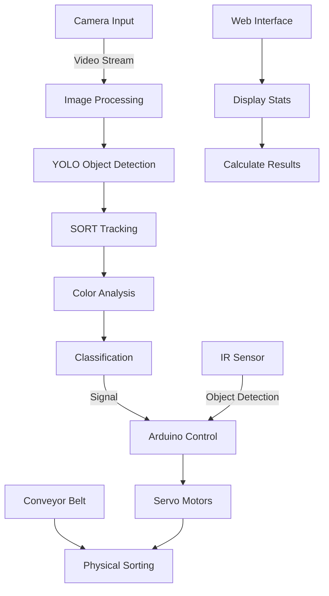
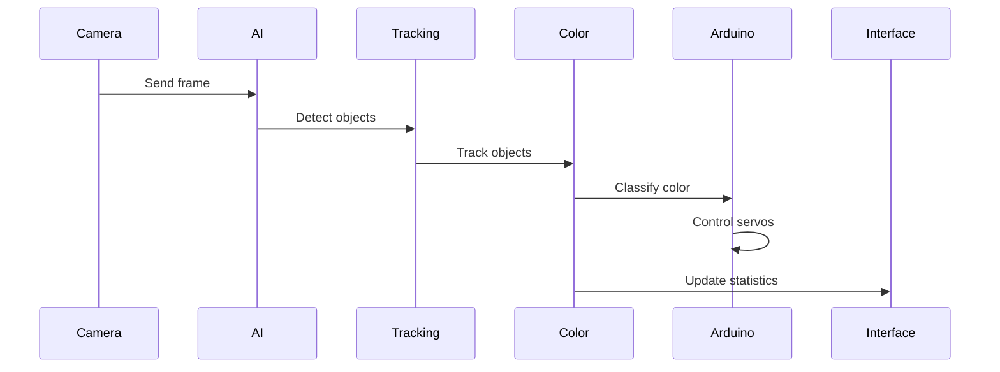

<h2>Display</h2>

<h3>This is the system interface</h3>


<h3>Reason</h3>

View the machine's operational progress.

Statistics on the percentage of each of the three types of cocoons.

Statistics on the weight of each type and how much of the total cocoon weight they occupy.

Calculate the amount of money for each type of cocoon.

Calculate the total amount of money for all three types.

<h2>Classification System:</h2>

Uses a servo motor mechanism to classify silk cocoons based on the AI model's evaluation results. 

This system includes a conveyor belt, sensors, and automated mechanisms to ensure that cocoons are classified accurately and quickly.

We use SolidWorks software to create the model for the classification and evaluation machine.


I deploy model on JETSON ORIN NANO

<h2>STEP MOTOR</h2>


<h2>System Architecture</h2>



<h2>RESULT</h2>

IN  images


<h2>System Components</h2>

### 1. Image Acquisition 🎥
- High-resolution camera capture
- Real-time frame processing
- Automatic brightness adjustment

### 2. Object Detection 🔍
- CNNmodel (ONNX optimized)
- High accuracy cocoon detection
- Real-time processing capability

### 3. Object Tracking 🎯
- SORT algorithm implementation
- Unique ID assignment
- Position and movement tracking

### 4. Color Classification 🎨
- HSV color space analysis
- Three categories:
  - White cocoons ⚪
  - Yellow cocoons 🟡
  - Brown cocoons 🟤

### 5. Mechanical Control 🔧
- Arduino-based servo control
- IR sensor integration
- Optimized sorting mechanism

### 6. User Interface 💻
- Real-time video feed
- Statistical analysis
- Price calculation system

<h2>Technical Specifications</h2>

- **Processing Speed**: 60 FPS
- **Classification Accuracy**: >95%
- **Response Time**: <100ms
- **Supported Resolution**: 640x480
- **Color Detection Precision**: HSV-based analysis

<h2>HOW TO RUN BACKEND</h2>

```python back_end.py```

<h2>HOW TO RUN SERVO AND APP</h2>

```python display.py```

<h2>HOW TO RUN PYTHON</h2>

```python main.py```

<h2>Data Flow</h2>


## 📝 License
MIT License BaoHan1712
------
No other individuals or organizations are involved
