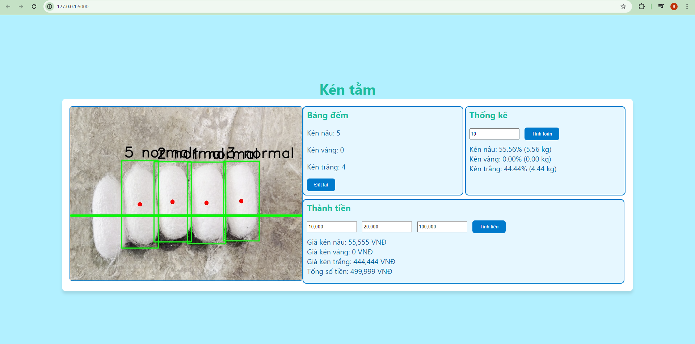
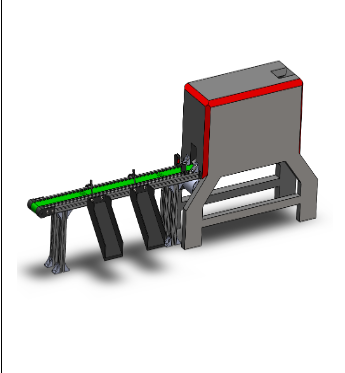

<h2>Display</h2>

<h3>This is the system interface</h3>



<h3>Reason</h3>

View the machine's operational progress.

Statistics on the percentage of each of the three types of cocoons.

Statistics on the weight of each type and how much of the total cocoon weight they occupy.

Calculate the amount of money for each type of cocoon.

Calculate the total amount of money for all three types.

<h2>Classification System:</h2>

Uses a servo motor mechanism to classify silk cocoons based on the AI model's evaluation results. 

This system includes a conveyor belt, sensors, and automated mechanisms to ensure that cocoons are classified accurately and quickly.

We use SolidWorks software to create the model for the classification and evaluation machine.



i deloy model on JETSON ORIN NANO

<h2>STEP MOTOR</h2>


<h2>RESULT</h2>

IN  images


<h2>HOW TO RUN BACKEND</h2>

```python back_end.py```

<h2>HOW TO RUN SERVO AND APP</h2>

```python display.py```

<h2>HOW TO RUN PYTHON</h2>

```python main.py```
